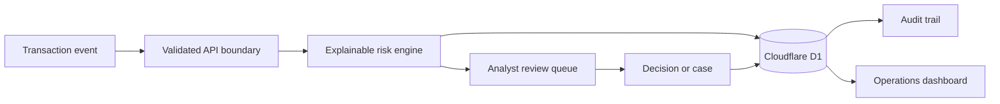

# Risk//OS — Financial Risk Intelligence

[](https://github.com/Harshith-shyamala/risk-intelligence-platform/actions/workflows/ci.yml)
[](package.json)
[](tsconfig.json)
[](worker/index.ts)

Risk//OS is a production-oriented financial risk operations platform for explainable transaction scoring, analyst review, investigation management, model monitoring, and auditable decisions.

> **Responsible-use boundary:** All included transactions are synthetic. This repository is an engineering reference implementation—not a certified fraud model or a substitute for regulatory, security, privacy, and model-risk review.

[Launch the private deployment](https://risk-os-intelligence.harshithh07.chatgpt.site) · [Architecture](docs/ARCHITECTURE.md) · [Roadmap](docs/ROADMAP.md) · [Security](SECURITY.md)


## Why this project exists

Financial-risk teams often work across disconnected queues, opaque model outputs, and weak audit trails. Risk//OS demonstrates a cohesive operating model: score each event, explain the decision, route uncertainty to a human, preserve investigator actions, and expose model-health signals in one workspace.

## Core capabilities

| Area           | Capability                                                                                                      |
| -------------- | --------------------------------------------------------------------------------------------------------------- |
| Risk engine    | Deterministic, versioned scoring with ranked reasons and approve/review/block recommendations                   |
| Operations     | Prioritized analyst queue, searchable transaction explorer, and detailed risk drawer                            |
| Investigations | Attributed approve/block decisions, case creation, ownership, priority, and status tracking                     |
| Governance     | Model version visibility, precision/recall/drift surfaces, immutable audit events, and synthetic-data labeling  |
| Platform       | Authenticated APIs, strict validation, prepared queries, request limits, D1 persistence, and no-store responses |

## Architecture



- **Experience:** React 19, TypeScript, server-rendered application shell
- **Runtime:** vinext on Cloudflare Workers
- **Persistence:** Cloudflare D1 / SQLite with Drizzle-managed migrations
- **Identity:** hosting-provided authenticated user headers; isolated demo identity on localhost
- **Scoring:** typed, deterministic baseline in [`lib/risk-engine.ts`](lib/risk-engine.ts)
- **Operations:** public health probe plus authenticated, non-cacheable product APIs

The deeper trust-boundary and production-readiness analysis lives in [`docs/ARCHITECTURE.md`](docs/ARCHITECTURE.md).

## Quick start

### Prerequisites

- Node.js 22.13 or newer
- npm 10 or newer

```bash
git clone https://github.com/Harshith-shyamala/risk-intelligence-platform.git
cd risk-intelligence-platform
npm ci
npm run dev
```

Open `http://localhost:3000`. The local runtime creates and seeds an isolated D1 database automatically.

## API surface

| Method | Route         | Purpose                                             | Authentication         |
| ------ | ------------- | --------------------------------------------------- | ---------------------- |
| `GET`  | `/api/health` | Service and scoring-model health                    | Public                 |
| `GET`  | `/api/risk`   | Transactions, cases, audit events, and model health | Required in production |
| `POST` | `/api/risk`   | Score, decide, or create a case                     | Required in production |

Supported write actions:

- `score` validates and scores a new synthetic transaction.
- `decide` records an approve or block decision with actor attribution.
- `create_case` opens an investigation linked to a transaction.

## Engineering quality

```bash
npm run lint       # static analysis and accessibility rules
npm run test:unit  # deterministic risk-engine tests
npm run check      # unit tests, production build, and SSR verification
```

The GitHub Actions workflow executes linting and the full verification suite on every push and pull request. Dependabot monitors npm and Actions dependencies weekly.

## Repository map

```text
app/                 Product UI and HTTP route handlers
db/                  D1 schema, persistence, and synthetic seed data
drizzle/             Ordered database migrations
lib/                 Explainable risk-scoring engine
tests/               Unit and rendered-output verification
docs/                Architecture and delivery roadmap
.github/             CI, ownership, issue forms, and PR standards
```

## Production boundary

Before connecting payment traffic or personal data, add tenant isolation, granular RBAC, managed secrets, idempotency, durable rate limiting, SIEM integration, retention controls, formal model validation, penetration testing, disaster recovery, and the applicable PCI DSS/SOC 2/privacy review.

## Contributing and security

Read [`CONTRIBUTING.md`](CONTRIBUTING.md) before opening a change. Please report security concerns privately according to [`SECURITY.md`](SECURITY.md); do not disclose vulnerabilities in public issues.

## License

Copyright © 2026 Harshith Shyamala. All rights reserved. No license is granted for copying, modification, distribution, or production use.
